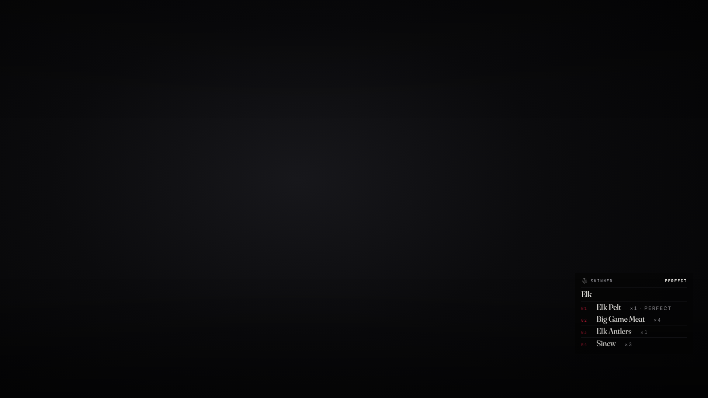

# lxr-hunting — Skin what you shot, for LXRCore

The game spawns the animals and judges the kill. This resource turns that
judgement into a graded pelt, meat by the size of the beast, the odd trophy
and a carcass to sell whole — all core catalog items, bought by the
trapper and the butcher on their usual shelves. A skinned animal is marked
on the entity itself, so it is skinned once, by anyone, from any client.



## What it does

* **Skin** — one option on any dead animal in `Config.Animals` through
  lxr-interact; needs the `skinning_knife` (graded, wears a little per skin).
* **Grade** — `GetPedQuality` (the animal) and `GetPedDamageCleanliness`
  (the shot) from the client, clamped and rounded on the server into a pelt
  quality of 1–3. The pelt carries it in `info.quality`; lxr-shops prices it.
* **The take** — pelt, meat (`meatMin..meatMax`), extras by chance (antlers,
  horns, teeth, feathers, fat, sinew, bone), and a `carcass_small` /
  `carcass_bird` / `carcass_medium` by size. Large animals are skinned
  where they fell. What you cannot carry is named, not lost silently.
* **License** — without `hunting_license`, a skin may raise a poaching call
  through lxr-dispatch when the law is on duty.
* **Events** — `lxr:hunting:skinned (src, animal, grade, got)`.

## Install

```cfg
ensure lxr-core
ensure lxr-interact
ensure lxr-dispatch   # optional: the poaching call
ensure lxr-hunting
```

## API

| Name | Side | Purpose |
|---|---|---|
| `Animal(model)` | server | animal id and definition for a model |
| `Grade(quality, cleanliness)` | server | the rounding rule |
| `Busy()` | client | is a skin in progress |

## Licence

© 2026 iBoss21 / LXRCore — All Rights Reserved. See `LICENSE`.
